# La Sombrilla Verde / Sombrilla Rosa

## Año 2003

Las primeras Sombrillas Verdes en habbo.es fueron creados por la ex-Staff [Cindy](https://habboxwiki.com/Cindy) de habbo.co.uk

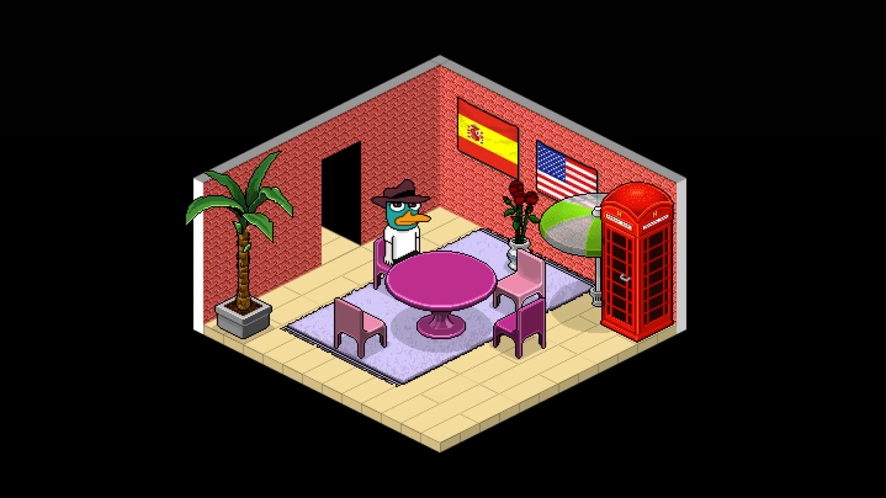
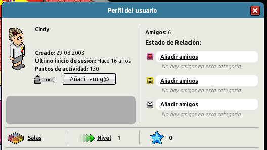

El usuario Cindy fue eliminado de habbo.co.uk en el año 2010 a causa de la fusión de hoteles de habla inglesa, y el 21 de Abril del año 2021 se eliminó su cuenta en habbo.es

Es posible que existan 2 Sombrillas Verdes de Cindy perdidas (ID 2863 y 2864), y la única sobreviviente le pertenece al usuario **Alcantara7**

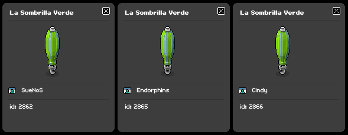

También se generó una Sombrilla Verde unos días después de salir el Holoboy al catálogo de Raros y no existe ningún registro en [Web Archive](https://web.archive.org/web/20030701000000*/http://www.habbohotel.es/habbo/es/) relacionado a la procedencia de este furni, así que es probable que la generó Arturo

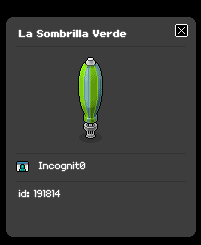

## Año 2004

En Febrero del año 2004 se realizó un concurso de búsqueda de una sala secreta dentro del hotel, en donde se le entregaría un regalo secreto a los primeros 10 usuarios que enviaran la contraseña correcta en el formulario del concurso

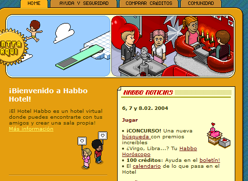

El único usuario que logró descubrir la contraseña correcta fue **Dyckola**, el cual fue recompensado con una Sombrilla Verde

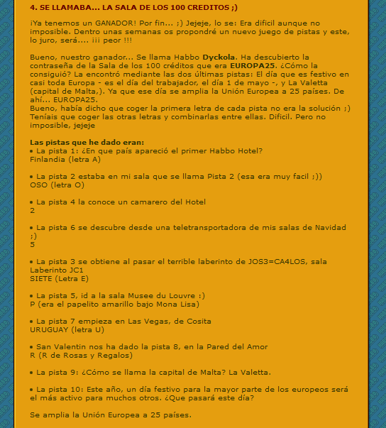

Actualmente esta Sombrilla Verde le pertenece al usuario **Markins2**

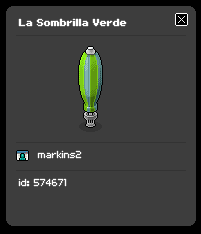

## Año 2006

El día 3 de Noviembre del año 2006 se realizó una nueva versión del Tomakefinde!! en donde se regalaron Sombrillas Verdes

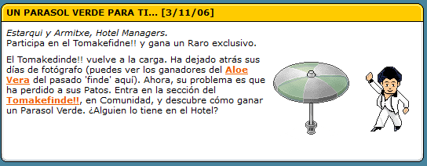

Los diez ganadores del Tomakefinde!! fueron recompensados con una Sombrilla Verde para cada uno

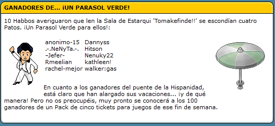

Actualmente solo se conoce el paradero de 5 de las 10 Sombrillas Verdes 

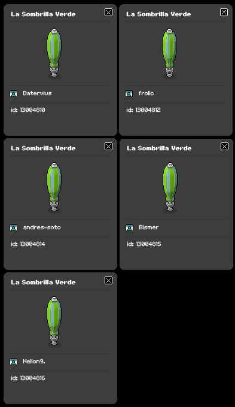

## Año 2010

En el año 2010 Sulake decidió iniciar una serie de actualizaciones enfocadas a permitir la [migración](https://habboxwiki.com/Merge) de los hoteles de habla inglesa hacia habbo.com

El cambio más importante fue la elección del regalo HC, que permitió seguir entregando regalos sin necesidad de tener problemas con las distintas IDs de los usuarios de los distintos hoteles de habla inglesa

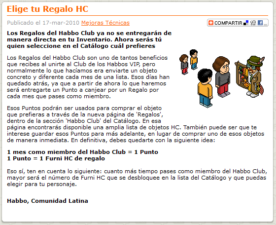

Este cambio produjo un error de duplicación de furnis en habbo ya que no existía validación en el furni que se seleccionaba como regalo

Al cambiar el código **A0 clubsofa** (El Club Sofa) por **A0 rareparasol** logré crear una nueva Sombrilla Verde en habbo.es, la cual fue baneada unas semanas después

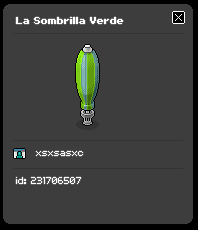

Otro cambio realizado en la migración de habbo.com fue la creación de un nuevo furni en el [furnidata](https://www.habbo.es/gamedata/furnidata_json/1) llamado Sombrilla Rosa

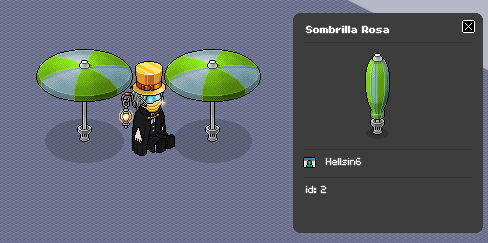

Este nuevo furni permitió hacer convivir en un mismo hotel las Sombrillas Verdes creadas con la estructura antigua (_rare_parasol_) con la nueva estructura de furnis (_rare_parasol*1_) añadida en el cambio de Shockwave a Flash del año 2009

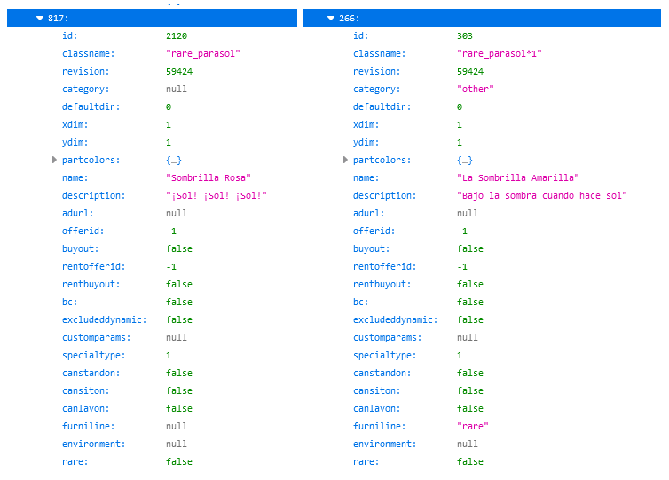

En habbo.es no se generaron Sombrillas Rosa ya que este hotel no participó en la migración, pero las Sombrillas Verdes de Markins2 y Alcantara7 deberían tener el nombre de Sombrilla Rosa

## 2010 - presente

Se han observado 3 nuevas Sombrillas Verdes generadas por Staffs en los últimos años

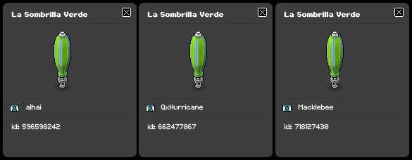

_Muchas gracias a Alcantara7 y Markins2 por mostrarme sus Sombrilas Verdes y a Tonisteiger por ayudarme con la investigación :D_